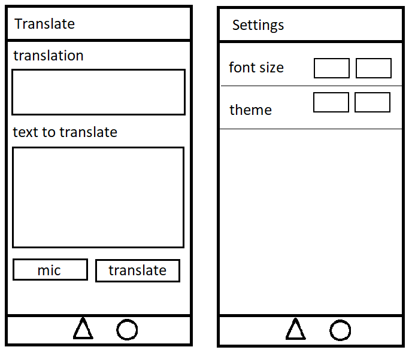

# DHA Funlation App - 2019 edition

### Students 
Tim Bastiaans & Wesley Andriessen

### Concept
This is a translation application using the Translator APIs from Funtranslations. (https://funtranslations.com/api#)
This application is developed using Ionic and has been tested to run on Android/IOS devices and in the Google Chrome browser.

### Screen sketches
The following images show the screen designs for this application.

### Chosen Technical requirements
- Ionic UI [Ionic UI componentent](https://ionicframework.com/docs/components)
- Sensor integration: [Microphone] & [Cameraflash]
- HTTP/API integration: [Funtranslations API] (https://funtranslations.com/api#)

## 1. Functionalities
The application includes the following functionalities:

- Text translator for the languages available at https://funtranslations.com/api#:
- Sending morse signals by using the cameraflash when translating morse code.
- Speech to text input for the translator.
- Text input for the translator.
- Settings menu with option to change the font size
- Settings menu with option to choose a different app theme.
- Storage to remember your chosen theme.

## 2. Requirements

- [Android sdk](http://www.androiddocs.com/sdk/installing/index.html)
- [Ionic](https://ionicframework.com/getting-started#cli)
- [Npm](https://www.npmjs.com/get-npm)
- Smart device or modern browser

## 3. Installation

Download the zip from Github or clone the project.

After cloning or downloading the project run the code below in the terminal.

- `npm install`
- `npm install --save ionic-native-http-connection-backend`
- `ionic cordova plugin add cordova-plugin-advanced-http`
- `ionic cordova plugin add cordova-plugin-speechrecognition`

To run the application in the browser run the code below in the terminal.

- `ionic cordova platform add browser`
- `ionic serve --cordova --platform browser`

To run the application on an android device run the code below in the terminal.

`ionic cordova run android`

Alternatively the Android/IOS application Devapp (https://ionicframework.com/docs/appflow/devapp/) can be used to deploy to a device. 
To run the application on your device run the code below in the terminal.

`ionic serve --devapp`
