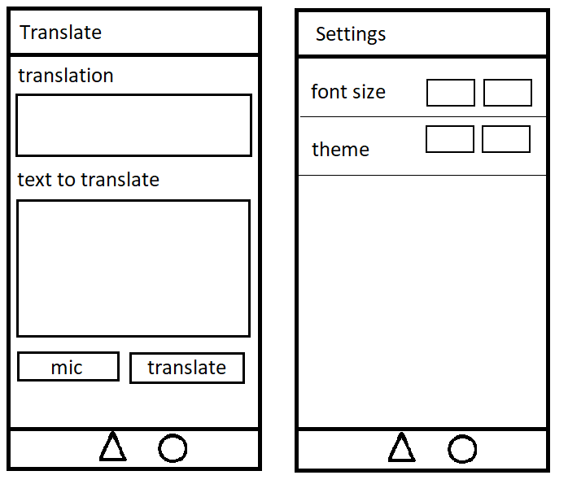
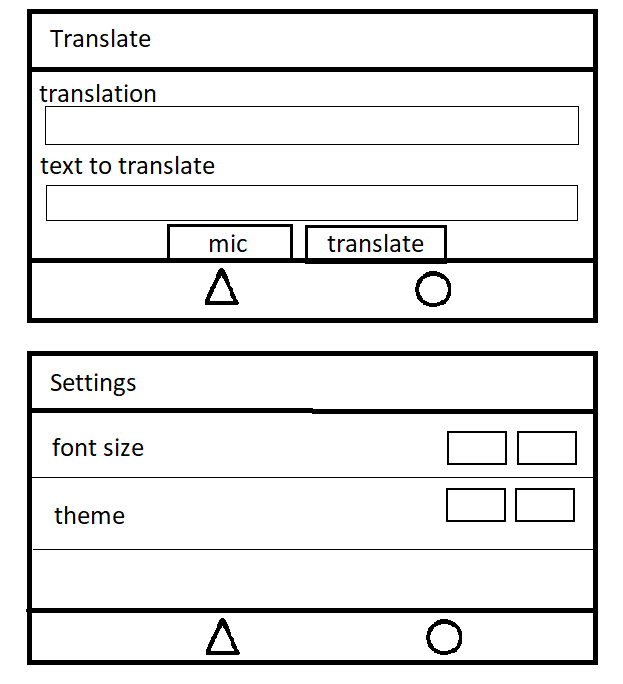

# DHA Morse Signal App - 2019 edition

### Students 
Tim Bastiaans & Wesley Andriessen

### Concept
This is a simple Morse Code Signal application using the Morse Translator API from Funtranslations. (https://funtranslations.com/api/morse)
This application is developed using Ionic and has been tested to run on Android/IOS devices and in the Google Chrome browser.

### Screen sketches
The following images show the screen designs for this application.

#### Portrait

#### Landscape

### Chosen Technical requirements
- Ionic UI [Ionic UI componentent](https://ionicframework.com/docs/components)
- Sensor integration: [Microphone] & [Cameraflash]
- HTTP/API integration: [Morse Translator API] (https://funtranslations.com/api/morse)

## 1. Functionalities
The application includes the following functionalities:

- Text to morse code translator.
- Sending morse signals by using the cameraflash.
- Speech to text input for the translator.
- Text input for the translator.
- Settings menu with options to change the font size and choose a different app theme.

## 2. Requirements

- [Android sdk](http://www.androiddocs.com/sdk/installing/index.html)
- [Ionic](https://ionicframework.com/getting-started#cli)
- [Npm](https://www.npmjs.com/get-npm)
- Smart device or modern browser

## 3. Installation

Download the zip from Github or clone the project.

After cloning or downloading the project run the code below in the terminal.

- `npm install`
- `npm install --save ionic-native-http-connection-backend`
- `ionic cordova plugin add cordova-plugin-advanced-http`
- `npm install @ionic-native/http`
- `npm install @ionic-native/speech-recognition`
- `ionic cordova plugin add cordova-plugin-speechrecognition`

To run the application in the browser run the code below in the terminal.

`ionic serve --cordova --platform browser`

To run the application on an android device run the code below in the terminal.

`ionic cordova run android`

Alternatively the Android/IOS application Devapp (https://ionicframework.com/docs/appflow/devapp/) can be used to deploy to a device. 
To run the application on your device run the code below in the terminal.

`ionic serve --devapp`

### 4. checklist Grade
Als minimaal voldaan is aan al de volgende vereisten:

- [x] 1. Geef je app folder een naam volgens de [github conventie](https://stackoverflow.com/questions/11947587/is-there-a-naming-convention-for-git-repositories) (kebab case)
- [x] 2. Zorg dat je app niet `MyApp` heet (de standaard naam)
- [x] 3. Stel (voor i.i.g. iOS/Android) direct een goede bundle identifier in (dus *niet* `io.ionic.starter`, maar eigen reverse domain name met 3 componenten, bv: `nl.dha.mijn-naam`)
- [x] 4. Twee (of meer) sensoren integratie (met `Promise` of `Observable` resultaat)
- [x] 5. Haalt data op via een `http` call (bij externe service/API, of evt. lokaal .json bestand)
- [ ] 6. Gebruikt een aantal Ionic controls/components (of controls uit andere library)
- [x] 7. Accepteert gebruikers input (uit de UI; hier wordt dus NIET sensor input genoemd, dat valt onder 4)
- [x] 8. Gebruik een aantal [ionicons](https://ionicons.com/) of indien gewenst een andere icon set
- [x] 9. Visualisatie van opgehaalde data
    - Doe dit met een control, grafiek of wellicht zelfs [SVG image](https://www.joshmorony.com/using-an-svg-for-animation-in-ionic/) of iets dergelijks
    - Dus niet alleen een `console.log` of kale getallen tonen (maar dat is wel beste punt om te beginnen)
- [x] 10. Maak een custom *app icon* en *splash screen* voor je app (met `[ionic resources](https://ionicframework.com/docs/cli/commands/cordova-resources)`):
> ionic cordova resources -help
- [x] 11. Als je sensors gebruikt die gebruikspermissie nodig hebben (zoals GPS), vraag dit dan op het goede moment (gebruiker voorbereiden, dus niet meteen, zie sheets les 5)
- [x] 12. Splits view-logica (component) van de sensor/business/overige-logica via gebruik van (eigen) injectables/services/providers (e.g. masseer de data voor via gebruik facade pattern ;)
